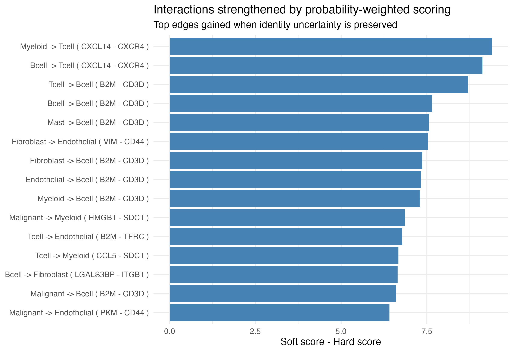
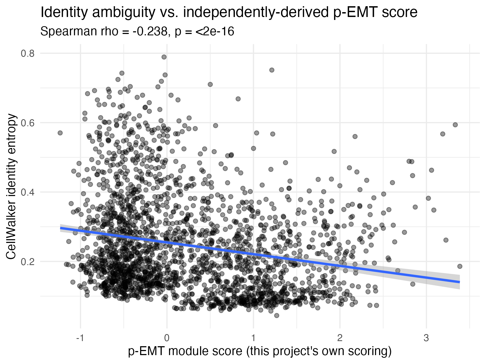

# Soft Cell-Cell Communication via CellWalker-Weighted Ligand-Receptor Scoring

**Status:** work in progress

## Motivation

Ligand-receptor communication tools (CellChat, LIANA, CellPhoneDB) require every
cell to be assigned a single, discrete cell-type label before communication
scores are computed. In tumor microenvironments, differentiation trajectories,
and other transitional biology, that discreteness is a fiction — many cells sit
between identities (e.g. the partial-EMT malignant cells described in
[Puram et al. 2017](https://doi.org/10.1016/j.cell.2017.10.044)), and a hard
`argmax` label discards exactly the information that makes those cells
interesting.

[CellWalker / CellWalkR](https://github.com/PFPrzytycki/CellWalkR) already
computes what we need: a graph-diffusion-based **probability distribution**
over cell types for every cell, rather than a hard label. This project uses
that distribution directly as a weighting scheme for ligand-receptor scoring,
producing a **soft communication network** where a cell's contribution to each
cell type's signaling profile is proportional to how confidently it belongs to
that type — instead of all-or-nothing.

**Question:** do identity-ambiguous cells (e.g. p-EMT malignant cells) show
signaling behavior that is invisible to hard-clustered communication analysis?

## Approach

1. Run CellWalkR on a tumor scRNA-seq dataset using published marker gene sets
   to get, for every cell, a full probability vector across cell types (not
   just the top label).
2. Compute a per-cell **identity entropy** score from that distribution to
   flag ambiguous cells.
3. Implement a probability-weighted ligand-receptor scoring function
   (`R/soft_weighting.R`) that computes expected per-type ligand/receptor
   expression as a probability-weighted average across cells, instead of a
   mean within a hard cluster.
4. Build the equivalent **hard** network (standard argmax-label CellChat/LIANA
   style scoring) as a baseline.
5. Compare soft vs. hard networks: which edges appear only in the soft
   version, and do they concentrate around high-entropy (ambiguous) cells?

## Dataset

[GSE103322](https://www.ncbi.nlm.nih.gov/geo/query/acc.cgi?acc=GSE103322) —
Puram et al. 2017, head & neck squamous cell carcinoma scRNA-seq (~6,000
cells: malignant, fibroblast, T cell, B cell, myeloid, endothelial, mast).
Chosen because the original paper's p-EMT signature gives an independent way
to validate that CellWalker's ambiguity scores are picking up something real.

Backup dataset: GSE72056 (Tirosh et al. 2016, melanoma) — simpler logistics,
same cell-type diversity.

**Data quirks worth knowing before touching this dataset again** (see comments
in `scripts/01_download_data.R` for full detail): the public matrix has 6
metadata rows (patient/site/malignancy/cell-type columns baked into the top of
the file, not a separate file) before gene expression starts, values are
already log2(TPM/10 + 1) — not raw counts — and patient IDs are only present
as inconsistent `HN<n>`/`HNSCC<n>` prefixes in the cell barcodes themselves
(plus a 109-cell pooled "combo" batch with no clean per-patient ID).

## Results so far

The full pipeline has been run end-to-end on the real dataset (not just
synthetic data):

- Parsed 5,902 cells — 2,215 malignant / 3,363 non-malignant / 324 the
  paper's own authors couldn't confidently classify — matching the paper's
  reported numbers exactly.
- CellWalkR's soft labels (argmax) agree with the paper's own ground-truth
  cell-type annotations at **96.9% accuracy** across the 6 non-malignant
  types + malignant (worst per-type recall: Myeloid at 78.5%, likely because
  Macrophage + Dendritic were pooled into one label).
- The 324 cells the paper's authors themselves flagged as too ambiguous to
  classify have the **highest identity entropy of any group** (mean 0.37,
  vs. 0.15–0.25 for confidently-typed cells) — CellWalker's entropy score
  agrees with the original authors' own judgment calls about which cells
  were hard to type, independent evidence the core premise holds.
- Soft-vs-hard network comparison using LIANA's real ~3,400-pair consensus
  resource (not a placeholder) surfaces edges across most cell-type pairs,
  including malignant-cell signaling (e.g. Malignant → Myeloid HMGB1-SDC1,
  Malignant → Endothelial PKM-CD44) that a hard-label network would score
  lower:

  

- **p-EMT correlation — real, but not in the direction the motivating
  question expected.** Identity entropy is significantly *negatively*
  correlated with p-EMT score among malignant cells (Spearman rho = -0.24,
  p < 2e-16, n = 2,215; robust to controlling for library complexity —
  partial rho still -0.24). Higher p-EMT does **not** make CellWalker more
  uncertain between Malignant and Fibroblast; instead cells become *more*
  confidently classified as Malignant as p-EMT rises (mean Malignant
  probability 0.83 → 0.89 across p-EMT quartiles), while mean Fibroblast
  probability barely moves (0.006 → 0.009). Most likely explanation: this
  project's marker panel uses only 6 broad-lineage genes per type, none
  p-EMT-specific, and none of the Fibroblast markers (COL1A1, COL1A2,
  COL3A1, DCN, PDGFRA, PDGFRB) are part of the p-EMT signature itself — so
  a coarse lineage-marker CellWalker setup isn't well-positioned to detect
  a transitional identity shift the way a p-EMT-aware marker set might.
  This is a real, reported result rather than confirmation of the original
  hypothesis:

  

## Repo structure

```
R/                 Reusable functions (the actual novel contribution)
  soft_weighting.R   Probability-weighted L-R scoring + hard baseline + comparison
  utils.R            Entropy scoring, marker gene helpers, plotting helpers
scripts/            Ordered analysis pipeline
  01_download_data.R
  02_run_cellwalker.R
  03_soft_communication.R
  04_compare_networks.R
vignettes/          Worked walkthrough (getting-started.Rmd)
data/               Raw + processed data (gitignored except for small refs)
```

## Setup

```r
install.packages(c("Matrix", "igraph", "ggplot2", "GEOquery", "devtools", "remotes"))

# CellWalkR's cellwalker2 branch pins Seurat to (>= 4.3, < 5.0). If you
# already have Seurat 5.x (the CRAN default), processRNASeq() will fail
# inside Seurat::RunPCA() with "subscript out of bounds" -- CellWalkR calls
# RunPCA() without explicit `features =`, relying on Seurat 4.x's default
# feature-resolution behavior. SeuratObject must be downgraded to match too
# (5.x removes the `slot=` argument Seurat 4.x's internals use):
remotes::install_version("Seurat", version = "4.4.0")
remotes::install_version("SeuratObject", version = "4.1.4")

devtools::install_github("PFPrzytycki/CellWalkR", ref = "cellwalker2")
# LIANA gives a convenient curated ligand-receptor resource, even though we
# bypass its scoring engine:
devtools::install_github("saezlab/liana")
```

Then run `scripts/01_download_data.R` through `04_compare_networks.R` in order,
or step through `vignettes/getting-started.Rmd`.

## Status / TODO

- [x] Confirm CellWalkR install path (CRAN version predates hierarchical
      features used here — need `cellwalker2` branch). Confirmed and pinned
      Seurat/SeuratObject versions (see Setup); rewrote
      `scripts/02_run_cellwalker.R` against the real `processRNASeq()` /
      `computeTypeEdges()` / `annotateCells()` API, verified end-to-end
      against CellWalkR's own bundled sample data. Note:
      `cellWalk$normMat` is a per-column Z-score (can go negative) — the
      probability matrix comes from row-normalizing the raw label-to-cell
      block of `cellWalk$infMat` instead (see script comments).
- [x] Finalize marker gene sets per cell type (paper supplementary table vs.
      PanglaoDB cross-check). Cell.com (403) and PMC (reCAPTCHA) both block
      automated access to Puram et al.'s actual supplementary PDF, so
      `scripts/build_marker_genes.R` uses well-established canonical
      lineage markers cross-checked against
      [PanglaoDB](https://panglaodb.se/markers.html) instead of a verbatim
      table transcription — someone with journal access should eventually
      diff this against the real Table S1/S5. Validated the Tcell/Bcell
      marker sets end-to-end against CellWalkR's bundled PBMC data: the
      resulting soft labels closely tracked the paper's own ground-truth
      annotations (531 vs. ~502 true T cells, 101 vs. ~92 true B cells).
      Fibroblast/Endothelial/Mast/Malignant markers are sourced the same
      way but can only be validated once real tumor tissue data (i.e. the
      parsed GSE103322 dataset) is available, since PBMC has none of those
      cell types.
- [x] Implement permutation-based significance for soft LR scores
      (`soft_lr_significance()` in `R/soft_weighting.R`)
- [x] Download + parse the real GSE103322 data
      (`scripts/01_download_data.R`) and run the full pipeline
      (`scripts/02_run_cellwalker.R` through `04_compare_networks.R`)
      end-to-end against it. See "Results so far" above. One additional
      wrinkle discovered along the way: GSE103322's public matrix is
      already log-normalized, not raw counts, so
      `CellWalkR::processRNASeq()` can't be used directly (it always calls
      `Seurat::NormalizeData()`, which would double-transform already-
      normalized values) — `scripts/02_run_cellwalker.R` replicates the
      rest of its pipeline manually instead, documented inline.
- [x] p-EMT score correlation with entropy. The user retrieved Puram et
      al.'s actual supplementary PDF and shared it directly (Table S7),
      which resolved the Cell.com/PMC access block. Turned out Table S7
      doesn't publish per-cell p-EMT scores at all — it publishes the
      p-EMT gene SIGNATURE (the NNMF-derived marker genes), so the score
      itself had to be computed here via `Seurat::AddModuleScore()`
      (`scripts/build_pemt_signature.R` + the p-EMT block in
      `scripts/04_compare_networks.R`). One gene of the ~100-gene
      signature was lost to the PDF's dense multi-column table layout
      during transcription (99 recovered) — accepted rather than guessed.
      See "Results so far" above for the (genuinely surprising, not
      hypothesis-confirming) finding.
- [x] Swap `example_lr_pairs()`'s 5-pair placeholder for LIANA's consensus
      resource (`scripts/03_soft_communication.R`). Two API surprises:
      the resource name is `"Consensus"` (capitalized) —
      `select_resource("consensus")` is case-sensitive and silently
      returns `NULL` rather than erroring — and ~23% of entries are
      multi-subunit complexes as underscore-joined gene symbols (e.g.
      `"ITGA4_ITGB7"`), which `score_lr_pairs()` can't use (it expects one
      gene symbol per side matching one row of the expression matrix), so
      those rows are dropped rather than expanded/summed. That leaves
      3,607 simple pairs, 3,394 with both genes present in GSE103322.
- [x] Polish + commit a real figure for the README (hard vs soft network
      diagram) — done now that the LR resource is real; see "Results so
      far" above.
